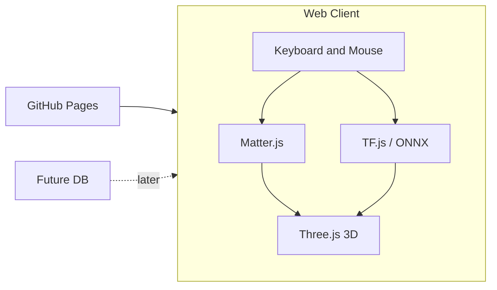

# Tech Stack

Design decisions for platform, physics, rendering, ML, input, and future data. Implementation should follow these choices unless a doc is updated.

---

## 1. Platform and hosting

- **Target:** Web-first; static site suitable for **GitHub Pages** (no server-side runtime).
- **Implications:** All runtime is browser + optional static hosting; no Node server required for the game itself.

---

## 2. Physics

- **Matter.js** for 2D physics. Gameplay is 2D (e.g. top-down or side-view) with 3D visuals—pieces break and move in a 2D plane. No 3D physics engine.

---

## 3. 3D rendering

- **Three.js** as the 3D solution: dominant web 3D library, works on GitHub Pages, strong ecosystem and examples.
- **Art direction:** Low-poly models built from **discrete pieces** (meshes/groups) so we can detach pieces for destructive FX.
- **Shaders and lighting:** Three.js supports custom shaders (GLSL) and dynamic lighting (e.g. `PointLight`, `SpotLight`, `DirectionalLight`, shadows). Custom shaders and dynamic lighting are requirements; exact pipeline deferred until needed.

---

## 4. Neural net (apprenticeship learning)

- **Goal:** Learn from how the player plays (imitation / apprenticeship).
- **Constraint:** Must run in the browser for GitHub Pages (no mandatory backend).
- **Options:** **TensorFlow.js** (in-browser training and inference), **ONNX Runtime Web** (inference of exported models). Prefer TensorFlow.js for in-browser training from player data unless we later train elsewhere and only run inference in the browser.
- **Scope:** Apprenticeship model, in-browser training/inference; exact architecture deferred to a future ML design doc.

---

## 5. Input

- **Keyboard and mouse** as the primary controls.

---

## 6. Data and storage (future)

- **Local game state:** Not required for initial GitHub Pages deploy; document as a future need (e.g. localStorage, IndexedDB, or file-based save).
- **Database (later):** For uploading **ship designs** and **training weights**; implies a backend and DB later (e.g. simple backend + Postgres, or serverless + DB). Future / out of scope for initial static host.

---

## 7. Overview

